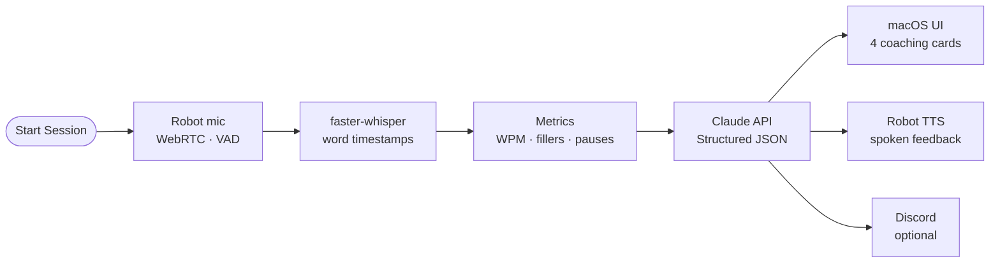

# Speech Coach

A macOS control panel for an embodied speech coach running on [Reachy Mini Wireless](https://www.pollen-robotics.com/reachy-mini/). The robot records your speech through its dedicated mic array, Whisper measures it, and Claude coaches you back — in your chosen voice and language.

> **Why the robot mic?** Reachy's mic array is directional and isolated. Using the Mac mic would pick up music, room noise, and anything else playing — defeating the purpose of accurate speech measurement.

---

## What it does

1. **Record** — Reachy captures your speech; auto-stops after 3 s of silence
2. **Transcribe** — Whisper analyses your WPM/CPM, filler words, pauses, and vocab diversity
3. **Coach** — Claude returns three things in your chosen voice:
   - What you've done well (with evidence from the transcript)
   - One specific thing to improve (quoting your exact words)
   - A concrete drill to practise before your next session



---

## What the robot does

The robot is an active participant, not a prop.

| Moment | Robot behaviour |
|---|---|
| Session start | Head tilts to attentive pose (10° forward), antennas raise upright |
| While you speak | Nods continuously + antennas waggle in alternating arcs |
| You pause (0.5 s+) | Stops moving entirely, leans 4° further forward — *"I'm listening, take your time"* |
| You resume | Nodding and waggle restart immediately |
| Feedback delivery | Speaks the *improve* and *drill* fields aloud via its own speaker |
| Throughout | Head tracks your face in real time using MediaPipe (10 Hz, EMA-smoothed) |

The pause reaction is the most deliberate behaviour: a physically still robot during silence signals that the pause is intentional and safe — which is the habit you're building.

---

## Project files

| File | What it does |
|---|---|
| `coach_ui.py` | macOS desktop UI: start/stop, transcript, coaching cards, language + voice selector |
| `create_app.sh` | macOS app builder: installs Speech Coach.app in /Applications — run once |
| `capture_audio.py` | Robot mic: WebRTC recording, adaptive silence detection, pause reaction |
| `embody.py` | Robot body: head orientation, eye contact tracking, nod, antenna waggle, TTS |
| `analyze.py` | Pipeline: Whisper transcription, WPM/CPM, fillers, pauses, vocab diversity |
| `feedback.py` | Pipeline: sends transcript + metrics to Claude, returns coaching in chosen voice |
| `progress.py` | History: session trends — pace, filler rate, vocab diversity, last drill |

---

## Coach voices

| Voice | Style |
|---|---|
| **Michelle Obama** *(default)* | Warm, grounded, deeply encouraging without being soft |
| **Marcus Aurelius** | Stoic, measured, philosophical — duty and self-mastery |
| **Paul Graham** | Direct, precise, slightly contrarian — cuts fuzzy thinking |
| **Steve Jobs** | Visionary, exacting, uncompromising about craft |
| **Yoda** | Ancient wisdom, inverted syntax, earned praise only |

---

## Languages

| Language | Pace metric | Target | Whisper model |
|---|---|---|---|
| English | WPM | 130–180 | `base.en` |
| French | WPM | 130–180 | `base` (multilingual) |
| Mandarin | CPM (chars/min) | 200–350 | `base` (multilingual) |

Claude responds in the same language as the recording. The multilingual model downloads automatically on first non-English use (~145 MB).

---

## Why not just use ChatGPT, Claude, or Gemini?

| | Speech Coach | Chat (text) | Voice mode |
|---|---|---|---|
| **Speech metrics** | WPM/CPM, filler rate, pause timing, vocab diversity — auto-computed | You count manually | Not exposed |
| **Pause detection** | Word-level timestamps from Whisper | Impossible | Impossible |
| **Feedback format** | Always: what worked / improve / drill, quoting your exact words | Whatever the model feels like | Whatever the model feels like |
| **Setup per session** | One click | Re-prompt every time | Re-prompt every time |
| **Progress over time** | Every session logged; `progress.py` shows trends | Nothing persisted | Nothing persisted |
| **Embodied coaching** | Reachy Mini: face tracking, nodding, pause reaction, spoken feedback | Screen only | Screen only |

The gap isn't the LLM — it's everything before it. ChatGPT, Claude, and Gemini can all comment on a transcript you paste in. None of them can measure your speech.

---

## Setup

### 1. Dependencies

```bash
source ~/reachy_mini_env/bin/activate
pip install faster-whisper anthropic python-dotenv mediapipe
```

### 2. API key

```bash
echo "ANTHROPIC_API_KEY=sk-ant-..." > ~/reachy-projects/speech-coach/.env
```

### 3. Create the app

```bash
cd ~/reachy-projects/speech-coach
bash create_app.sh
```

Creates **Speech Coach.app** in `/Applications`. Double-click to launch. Reachy Mini must be awake and on the same WiFi network before starting a session.

> The UI uses the system Python at `/Library/Frameworks/Python.framework/Versions/3.12`. Pipeline scripts run inside `~/reachy_mini_env`.

---

## Interface

```
Speech Coach 🎙
Speak. Listen. Get better.
────────────────────────────────────────
● Ready when you are ✦

Language [ English ▾ ]   Coach voice [ Michelle Obama ▾ ]

[ Start Session ]  [ Stop ]

WHAT YOU SAID 💬
┌──────────────────────────────────────┐
│ transcript appears here              │
└──────────────────────────────────────┘

WHAT YOU'VE DONE WELL ✓
┌──────────────────────────────────────┐
│ what worked appears here             │
└──────────────────────────────────────┘

ONE THING TO WORK ON
┌──────────────────────────────────────┐
│ improve appears here                 │
└──────────────────────────────────────┘

YOUR DRILL 💪
┌──────────────────────────────────────┐
│ drill appears here                   │
└──────────────────────────────────────┘
```

---

## Configuration

| File | Constant | Default | Effect |
|---|---|---|---|
| `capture_audio.py` | `SPEECH_RATIO` | `6.0` | Raise if auto-stop fires mid-sentence |
| `capture_audio.py` | `SILENCE_DURATION` | `3.0 s` | Quiet time before auto-stop |
| `capture_audio.py` | `PAUSE_REACTION_DELAY` | `0.5 s` | Silence before robot leans in |
| `embody.py` | `NOD_AMP_DEG` | `6.0` | Head nod amplitude (degrees) |
| `embody.py` | `PAUSE_LEAN_DEG` | `4.0` | Forward lean during speaker pause |
| `embody.py` | `MAX_YAW_DEG` | `25.0` | Max head turn for face tracking |

---

## Discord notifications (optional)

1. Discord → channel → Edit → Integrations → Webhooks → New Webhook → Copy URL
2. Add to `.env`:
   ```
   DISCORD_WEBHOOK_URL=https://discord.com/api/webhooks/...
   ```

Embed includes duration, pace, fillers, vocab diversity, and full coaching feedback. Silently skipped if unset.

---

## Progress tracking

```bash
python progress.py        # all sessions
python progress.py -n 10  # last 10 only
```

Trend table with sparklines for pace, filler rate, vocab diversity, and your last drill.
